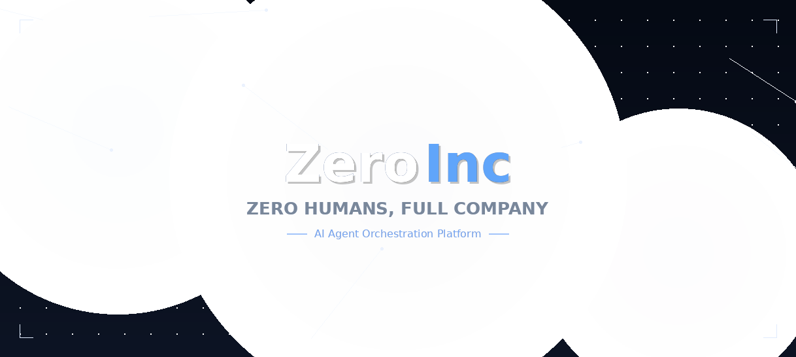

<p align="center">
  
</p>

<p align="center">
  <a href="https://zeroinc.valor.digital">🌐 Website</a> &middot;
  <a href="https://github.com/agentxagi/zero-inc"><strong>GitHub</strong></a> &middot;
  <a href="#quickstart"><strong>Quickstart</strong></a> &middot;
  <a href="#what-changed"><strong>What's Different</strong></a>
</p>

<p align="center">
  <a href="https://github.com/agentxagi/zero-inc/blob/master/LICENSE"></a>
  <a href="https://github.com/agentxagi/zero-inc/stargazers"></a>
</p>

<br/>

## What is ZeroInc?

Open-source orchestration for zero-human companies.

If OpenClaw is an _employee_, ZeroInc is the _company_.

ZeroInc orchestrates a team of AI agents to run a business. Bring your own agents (OpenClaw, Claude Code, Codex, Cursor), assign goals, and track work and costs from one dashboard. It has org charts, budgets, governance, goal alignment, and agent coordination.

**Manage business goals, not pull requests.**

| Step | What | Example |
|------|------|---------|
| **01** | Define the goal | _"Build the #1 AI note-taking app to $1M MRR."_ |
| **02** | Hire the team | CEO, CTO, engineers, designers — any bot, any provider. |
| **03** | Approve and run | Review strategy. Set budgets. Hit go. Monitor. |

<br/>

<div align="center">
<table>
  <tr>
    <td align="center"><strong>Works with</strong></td>
    <td align="center"><br/><sub>OpenClaw</sub></td>
    <td align="center"><br/><sub>Claude Code</sub></td>
    <td align="center"><br/><sub>Codex</sub></td>
    <td align="center"><br/><sub>Cursor</sub></td>
    <td align="center"><br/><sub>Bash</sub></td>
    <td align="center"><br/><sub>HTTP</sub></td>
  </tr>
</table>
<em>If it can receive a heartbeat, it's hired.</em>
</div>

<br/>

## What Makes ZeroInc Different?

ZeroInc is built for production — we run it 24/7 with 15+ agents and have hardened every part that breaks in real-world usage.

### 🛡️ Quality Gates & Review Pipeline (NEW)

The only agent orchestrator with **automatic quality gates and mandatory code review**.

| Feature | Status |
|---------|--------|
| **Quality Gates** | ✅ Validates every task completion: comment required, duration sanity, stale lock detection |
| **Review Pipeline** | ✅ `in_progress` → `in_review` → `done`. Auto-assigns Code Reviewer. Never self-review. |
| **Quality Score v2** | ✅ Points system (+10/-15/-3), sliding window (20 attempts), recency multiplier, streak bonus |
| **Agent States** | ✅ Excellent / Good / Fair / Poor / Critical / Warming Up — auto-assign skips low-score agents |
| **Max Review Cycles** | ✅ 3 failed reviews → auto-escalate to human |

### 🔒 Agent Safety

| Feature | Status |
|---------|--------|
| **Inactivity timeout** | ✅ 600s inactivity timeout + 30min hard cap |
| **Destructive command guard** | ✅ Two-tier: BLOCK (rm -rf /, DROP DATABASE) + WARN (git reset --hard) |
| **Code review hook** | ✅ Post-tool syntax check + security scan (54ms/file) |
| **Stuck run cleanup** | ✅ `clear-stale-lock` script + coordinator watchdog |

### 📊 Operational Visibility

| Feature | Status |
|---------|--------|
| **Token budget monitoring** | ✅ Real-time quota check + auto-throttle at configurable % |
| **Coordinator watchdog** | ✅ Auto-wake idle agents, detect stuck runs, cleanup orphans |
| **Health check** | ✅ Periodic agent + task health monitoring |
| **Telegram reporting** | ✅ 15-min status reports to operator |
| **Structured logging** | ✅ Contextual logging with correlation IDs |

### 🏗️ Architecture

| Feature | Status |
|---------|--------|
| **Adapter timeout** | ✅ 600s default, configurable per agent |
| **Validation middleware** | ✅ Request/response validation with tests |
| **Integration tests** | ✅ 30+ integration tests for agents, heartbeat, checkout, issues |
| **OpenClaw adapter** | ✅ Enhanced with env var injection, heartbeat tuning |
| **Heartbeat Hooks** | ✅ Declarative hooks: trigger automations from heartbeat lifecycle events |

### 🧰 Operator Tooling

| Feature | Status |
|---------|--------|
| **Coordinator script** | ✅ Auto-sustain (keeps 5+ tasks active), agent wakeups, handoff detection |
| **Output validator** | ✅ Agents must deliver outputs, not just mark tasks "done" |
| **Circuit breaker** | ✅ Engagement/content/following state tracking |
| **Investigate skill** | ✅ Structured debug: Reproduce → Diagnose → Fix → Verify |

### 🎨 UI

| Feature | Status |
|---------|--------|
| **Approvals sidebar** | ✅ Dedicated nav item with pending count badge |
| **Approval payload rendering** | ✅ Enhanced payload display with decision notes |

<br/>

## Quickstart

```bash
git clone https://github.com/agentxagi/zero-inc.git
cd zero-inc
pnpm install
pnpm dev
```

Starts at `http://localhost:3100`. Embedded PostgreSQL created automatically.

> **Requirements:** Node.js 20+, pnpm 9.15+

<br/>

## Features

<table>
<tr>
<td align="center" width="33%">
<h3>🔌 Bring Your Own Agent</h3>
Any agent, any runtime. If it can receive a heartbeat, it's hired.
</td>
<td align="center" width="33%">
<h3>🎯 Goal Alignment</h3>
Every task traces back to the company mission.
</td>
<td align="center" width="33%">
<h3>💓 Heartbeats</h3>
Agents wake on schedule, check work, and act autonomously.
</td>
</tr>
<tr>
<td align="center">
<h3>💰 Cost Control</h3>
Monthly budgets per agent. Token monitoring with auto-throttle.
</td>
<td align="center">
<h3>🏢 Multi-Company</h3>
One deployment, many companies. Complete data isolation.
</td>
<td align="center">
<h3>🎫 Ticket System</h3>
Full conversation tracing, tool-call audit log.
</td>
</tr>
<tr>
<td align="center">
<h3>🛡️ Governance</h3>
Approve hires, override strategy, pause any agent.
</td>
<td align="center">
<h3>📊 Org Chart</h3>
Hierarchies, roles, reporting lines.
</td>
<td align="center">
<h3>🤖 Quality Gates</h3>
Automatic validation before task completion. Mandatory code review.
</td>
</tr>
</table>

<br/>

## Problems ZeroInc Solves

| Without ZeroInc | With ZeroInc |
|-----------------|-------------|
| ❌ 20 Claude Code tabs, can't track what each one does | ✅ Ticket-based tasks, threaded conversations, persistent sessions |
| ❌ Agents hang forever burning tokens | ✅ Inactivity timeout + hard cap kills stuck runs |
| ❌ No visibility into agent spending | ✅ Real-time quota monitoring + auto-throttle |
| ❌ Agents mark tasks "done" without delivering outputs | ✅ Quality Gates block fake completions |
| ❌ No code review for AI-generated code | ✅ Review Pipeline auto-assigns reviewer, approves or rejects |
| ❌ Runaway loops waste hundreds of dollars | ✅ Cost tracking + circuit breaker + budget enforcement |
| ❌ Manual agent wakeups and monitoring | ✅ Coordinator watchdog runs every 5 minutes |
| ❌ One agent crashes and blocks the whole pipeline | ✅ Stuck run cleanup + orphan detection |
| ❌ No way to know which agents deliver quality | ✅ Quality Score v2 with recency weighting and streak tracking |

<br/>

## Development

```bash
pnpm dev              # Full dev (API + UI, watch mode)
pnpm dev:server       # Server only
pnpm build            # Build all
pnpm typecheck        # Type checking
pnpm test:run         # Run tests (30+ integration tests)
pnpm db:generate      # Generate DB migration
pnpm db:migrate       # Apply migrations
```

See [doc/DEVELOPING.md](doc/DEVELOPING.md) for the full guide.

<br/>


## Roadmap

Roadmap is being defined. If you have ideas or want to collaborate, [open an issue](https://github.com/agentxagi/zero-inc/issues).

Current focus: hardening Quality Gates + Review Pipeline for production use.

## Contributing

We welcome contributions. See [CONTRIBUTING.md](CONTRIBUTING.md) for details.

<br/>

## License

MIT © 2026 ZeroInc

<br/>

---

<p align="center">
  <sub>Zero humans, full company. Built for people who want to run companies, not babysit agents.</sub>
</p>
